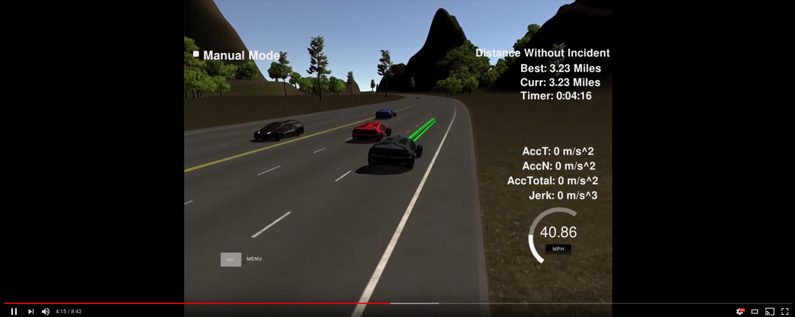
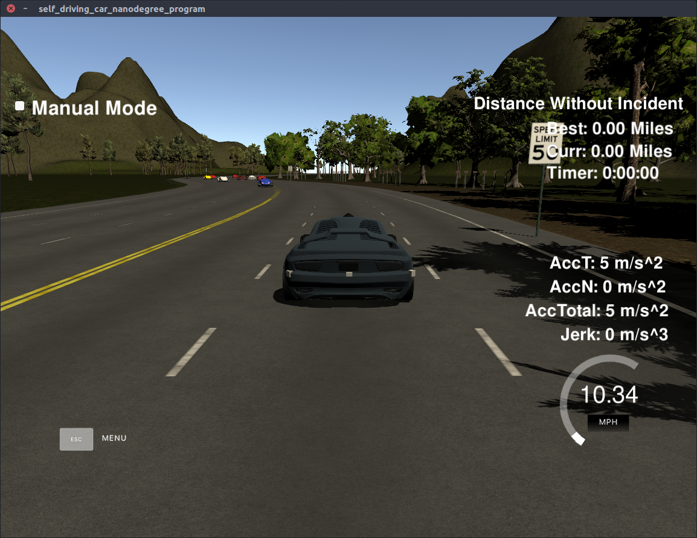

This repository contains the project solution to Udacities semester 3 Project 1: Path Planning. It takes in sensor fusion data from the environment and creates a trajectory that can navigate a highway environment without colliding, speeding or excessive acceleration or jerk. A video of the filter in action can be seen below.

 [](https://youtu.be/Ea4QmE2k3j4)

## Project website

This repository has an accompanying project page, contains the theory and details behind the code. It can be found [here](https://www.haidynmcleod.com/path-planning).

### Simulator.
You can download the Term3 Simulator which contains the Path Planning Project from the [releases tab (https://github.com/udacity/self-driving-car-sim/releases).

---

## Dependencies

* cmake >= 3.5
 * All OSes: [click here for installation instructions](https://cmake.org/install/)
* make >= 4.1
  * Linux: make is installed by default on most Linux distros
  * Mac: [install Xcode command line tools to get make](https://developer.apple.com/xcode/features/)
  * Windows: [Click here for installation instructions](http://gnuwin32.sourceforge.net/packages/make.htm)
* gcc/g++ >= 5.4
  * Linux: gcc / g++ is installed by default on most Linux distros
  * Mac: same deal as make - [install Xcode command line tools]((https://developer.apple.com/xcode/features/)
  * Windows: recommend using [MinGW](http://www.mingw.org/)
* [uWebSockets](https://github.com/uWebSockets/uWebSockets)
  * Run either `install-mac.sh` or `install-ubuntu.sh`.
  * If you install from source, checkout to commit `e94b6e1`, i.e.
    ```
    git clone https://github.com/uWebSockets/uWebSockets
    cd uWebSockets
    git checkout e94b6e1
    ```

## Basic Build Instructions

1. Clone this repo.

  ```sh
  $ git clone https://github.com/Heych88/udacity-sdcnd-path-planning.git
  ```

2. This repository includes two files that can be used to set up and install [uWebSocketIO](https://github.com/uWebSockets/uWebSockets) for either Linux or Mac systems. For windows, you can use either Docker, VMware, or even [Windows 10 Bash on Ubuntu](https://www.howtogeek.com/249966/how-to-install-and-use-the-linux-bash-shell-on-windows-10/) to install uWebSocketIO.

  Install [uWebSocketIO](https://github.com/uWebSockets/uWebSockets) by running the script

  For Linux
  `
  bash install-ubuntu.sh
  `

  For Mac
  `
  sh install-mac.sh
  `

3. Run path_planning

  ```sh
  $ ./path_planning
  ```

If the above fails, install [uWebSocketIO](https://github.com/uWebSockets/uWebSockets) separately, then build and run by doing the following from the project top directory.

1. Make a build directory: `mkdir build && cd build`
2. Compile: `cmake .. && make`
3. Run it: `./path_planning`.

---

## Running in the Simulator

The following assumes the **Basic Build Instructions** was followed and produced no errors.

Download and extract the [simulator](https://github.com/udacity/self-driving-car-sim/releases/tag/v1.0).

1. Navigate to the extracted simulator directory and run the simulator.
2. Select the settings best for your computer and click **ok**.
3. run the *Project 1: Path Planning* environment.
4. In a terminal window run the Path Planning executable
```sh
$ ./path_planning
```

The car will now drive around the track, and you should arrive at a result similar to the below.


