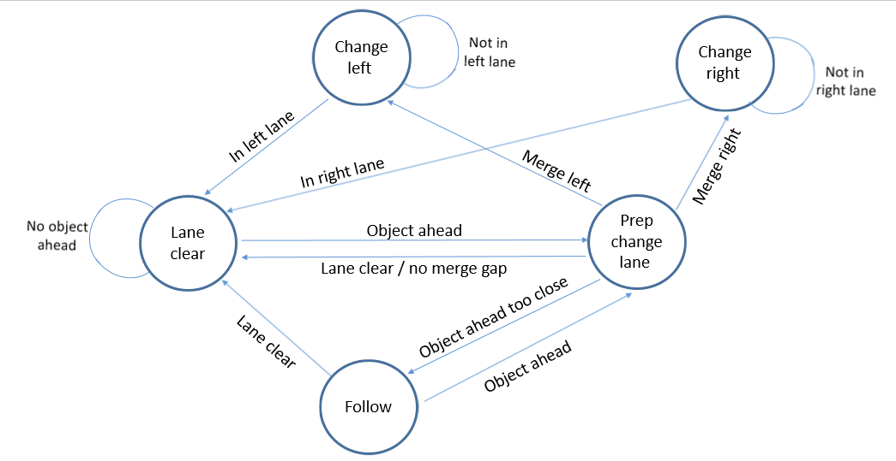
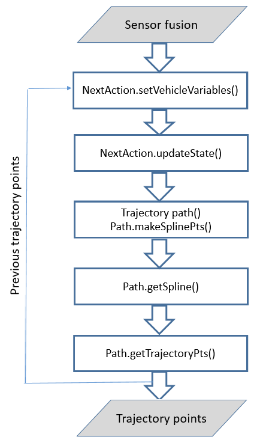

## Project: Path Planning

---

**Steps to complete the project:**  

1. Implement a trajectory planner that travels in a set lane.
2. Setup the planner, so the car drives according to the speed limit.
3. Prevent exceeding the max Acceleration and Jerk.
4. Implement a Finite State Machine for safe vehicle operation.
4. Employ collision avoidance for safe navigation.
5. Administer lane changes to navigate around other vehicles.

[image1]: ./img/transform_formula.png

## [Rubric](https://review.udacity.com/#!/rubrics/1020/view) Points
### Here I will consider the [rubric points](https://review.udacity.com/#!/rubrics/1020/view) individually and describe how I addressed each point in my implementation.  

---
### Writeup

#### 1. Provide a Writeup that includes all the rubric points and how you addressed each one. You can submit your write-up as markdown or pdf.  

You're reading it!

### Valid Trajectories

Here I'll talk about the individual code sections implemented to solve each of the following tasks, what techniques I used, what worked and why, where the implementation might fail and how I might improve it if I were going to pursue this project further.

#### 1. The car can drive at least 4.32 miles without incident.

A Video of an incident-free run around the track can be found [here](https://youtu.be/Ea4QmE2k3j4) or under the Simulation section.

#### 2. The car drives according to the speed limit.

In the Simulator, Every 20 ms the car moves to the next trajectory point on the path planning list. Because of this, the velocity of the vehicle depends on the spacing between these points. That is, the larger the spacing, the faster the car will travel. The speed goal is to have the vehicle moving at (but not above) the 50 MPH speed limit as often as possible.

With these limitations, the function `Trajectory::getStep()`, located between lines 437 and 477 of the header file `trajectory.h`. This function serves two properties

1. Prevent over speeding
2. Prevent excessive acceleration and Jerk

The following code can be located in the header file `trajectory.h`.

###### Task 1: Prevent over speeding

The simulator steps the trajectory every 20ms. With a 50 Mph speed limit, the max step every 20ms is calculated and stored in the variable `max_step` located on line 442. However, since the simulator is in metres but the speed in miles, a conversion variable `mile_ph_to_meter_ps` is used to convert between the two.

Once the `max_step` is known, the Euclidean distance between the previous point and the desired new point in compared to the `max_step`. When the step size is larger, the step size is decremented by the error size and continually repeated until the distance is less than `max_step` or the loop counter is exceeded. The code for this can be found between lines 462 and 479.

###### Task 2: Prevent excessive acceleration and Jerk

As acceleration is the rate of change between two steps, each 20ms step can only increment a fraction of the allowed 10m/s^2. Through trial and error, a comfortable acceleration and jerk minimising step value were found to be 0.0022. This amount equates to approximately 6m/s^s, in a straight line. The value is stored in the variable `acceleration` located on line 440.

This value is used to either increment (accelerate) or decrements (decelerate) each 20ms step. The change in step is calculated based on the desired vehicles end velocity and I located between lines 444 and 448.

#### 3. Max Acceleration and Jerk are not Exceeded.

The prevention of excessive acceleration and jerk is covered above in *Task 2: Prevent excessive acceleration and Jerk*.

#### 4. The car does not have collisions.

Collision avoidance is performed in the following sequence using a finite state machine.

1. Move into the current system state function.
2. Check sensor data for surrounding objects.
3. Check if the objects violate safety or collisions.
4. Update the state.

Collision avoidance and the finite state machine code can be located in the header file `pathstate.h`. The following describes the functions used in this header file.

###### Task 1: Move into the current system state function

Each state is located by the use of a switch statement in the function `NextAction::updateState`, between line 321 and 435.

There are five system states;
1. *lane clear* - For current lane driving at the speed limit.
2. *prep change lane* - For finding the best adjacent lane to be in and a safe merge gap to change lane with.
3. *follow* - For following a vehicle at a safe distance when a merge is not possible.
4. *change left* - For merging into the left lane.
5. *change right* - For merging into the right lane.

How the system flows from state to state is illustrated below in the state diagram.

###### Task 2: Check sensor data for surrounding objects

Each state updates the vehicle surroundings by calling the function `NextAction::checkSurrounding()` with the latest sensor fusion data. The function is located between lines 210 and 289.

This function iterates through the tracked objects from the sensor fusion data. An object is only checked if their position is in either the current lane or the lanes on the left or the right. Objects Frenet S distance is only considered if the object is within a set distance from the vehicle, as set with the variables `look_ahead_dist` and `look_behind_dist`, set on lines 96 and 97 respectively.

If the Frenet coordinate system is unknown, the youtube video [TNB or Frenet Frame](https://www.youtube.com/watch?v=Rk1EHeQYni0) provides a good introduction.

The function performs three tasks on objects that meet the positional requirements.

1. Calculate the objects cost
2. Check for a merge gaps
3. Locate and store the nearest objects data

The costs are calculated in the function `NextAction::getCost()`, located between lines 184 and 207. The accumulated objects costs are;
1. The velocity cost between the vehicle and the object speed.
2. The velocity cost between the speed limit and the objects speed.
3. The Frenet s distance between the vehicle and the object.
4. The Frenet s distance between the vehicle and the object, one second in the future.

The object costs are added together based on the position of the object relative to the vehicle. That is the cost is broken into five sections;
1. Lane on the left and in front, line 245
2. Current vehicles lane and in front, line 235
3. Lane on the right and in front, line 267
4. Lane on the right and behind, line 274
4. Lane on the left and behind, line 252

The costs are used to find the fastest travelling lane with the smallest amount of traffic on it, but will not find a mergeable gap in a lane. Upon setting the latest vehicle data, by calling function `NextAction::setVehicleVariables()`, line 130, a merge gap is assumed and the corresponding variables `is_gap_left` and `is_gap_right` are set to true. However, it will be set to false if the position of the object is within a merge window, as set with the variables `follow_dist` and `action_behind_dist`, set on lines 99 and 98 respectively. The `is_gap_left` merge check is performed on lines 261 and 263 and `is_gap_right` on lines 283 and 285.

The storing of the nearest object in each lane is broken down into the same five sections as outlined in the cost. The closest objects Frenet S and speed are then stored in a class struct for use in the finite state machine. The code for setting the five object struct values are located between lines 238 and 278.

###### Task 3: Check if the objects violate safety or collisions

After the `NextAction::checkSurrounding()` function has returned, each state will then check the updated class values from checkSurrounding functions.

Avoiding collisions is performed differently between states, but all state will first check if there is an object in the same lane that requires the vehicle to slow down and follow. The following distance is set with the variable `follow_dist`, set on line 99. When an object is within this distance, the desired vehicle velocity is dropped to match the lead vehicles velocity by calling the function `NextAction::getFollowSpeed()`, located between lines 286 and 305. The function is only called when in the *follow*, *change left* and *change right* states. This feature adjusts the vehicles desired velocity, dependent on the distance to the lead object and stops the vehicle when the object is nearly stationary or less than 5m away.

The state *prep change lane* will perform an additional task to prevent collisions. It will compare all lane costs and will attempt to move or stay in the lane that has the lowest cost value. When either the left or right lanes have a lower cost, it will wait until the `is_gap_left` or `is_gap_right` indicate a safe merge gap is present. The code for merge request is checked between lines 365 and 373.

###### Task 4: Update the state

During collision and safety checks, each state will either change or remain in the same state. The transition between states in outlined in the Finite state machine diagram in task 1. All state updates are updated during the safety and collision checks described in task 3 and only in the function `NextAction::updateState`, between line 322 and 435.

#### 5. The car stays in its lane, except for the time between changing lanes.

The following functions are found in the header file `trajectory.h`.

As the Frenet (s, d) coordinate system follows the centre yellow line. The function `Trajectory::makeSplinePts()`, located between line 359 and 389, uses a group of s points spaced 25m apart starting at the cars current s position are converted them, along with the same desired lanes centre d value, into cartesian coordinates using the function `Trajectory::getXY()`, located between line 262 and 287. These spaced x & y points are then transformed into the vehicle reference frame.  

Once the points have been set, the function `Trajectory::getSpline()`, located between line 391 and 401, uses a spline function to link the points along the path smoothly.

Following this the vehicles trajectory path is created by calling the function `Trajectory::getTrajectoryPts()`, between lines 417 and 468. This code uses the calculated spline function to produce vehicles trajectory waypoints along the road for every 20ms simulator update. The number of waypoints calculated is set with the variable `way_pts_tot`, on line 432.

#### 6. The car is able to change lanes

As outlined in *task 3: Check if the objects violate safety or collisions* of *section 4: Car does not have collisions*, changing lanes is dependent on three elements.

1. An object is present in the current lane.
2. The adjacent lanes have a lower cost than the existing lane.
3. There is a safe merge gap present.

When the above three elements are satisfied, the state will transition to either *change left* or *change right*. Upon setting these states on lines 349 and 353 respectively, the new driving lane will be updated, and when the spline functions are called, the trajectory will transition smoothly to the new lane.

The *change left* or *change right* states will only transition to the *clear lane* state when the vehicle is within a 1/2 metre tolerance of the new lanes centre line. The *change left* and *change right* states are located between lines 370 and 408 of the header file `pathstate.h`.

### Reflection

The above sections describe how and where each function is located in the code. Below will briefly overview of the system flow outlined in the following image.

[]

As can be seen above, the process of creating a planned path is;

1. Get the latest sensor fusion data.
2. Update the class `NextAction` with the latest system variables.
3. Update the finite state machine.
4. Initialise a new `Trajectory` class and update its points with the unused previous path points.
5. Create a new spline with the updated desired variables from the `NextAction` class.
6. Update the previous trajectory path with the new waypoints.
7. Pass the updated trajectory points to the simulator.

The above system process code is located in the function `main()`,  between lines 128 and 144 in the file `main.cpp`.

#### Bugs, limitations and future work

##### Bugs

* Speed will oscillate on a small part of the highway, due to the trajectory steps being above the `max_step` value, as described in *Task 1: Prevent over speeding* of section 2. The current fix is to limit the step decrease to 0.97% of the original step size for a max of five iterations.

* A lane with more vehicles in it, but moving faster with merge gaps will have a high cost associated with that lane and the vehicle will consider it a wrong path and not merge into that lane, even when it is regarded as the correct action to take. This bug is due to the large `look_ahead_dist` variable and can be minimised by decreasing its value.

* cannot stop in time if objects are stationary and travelling at speed. This is due to the deceleration rate and the `follow_dist` variable distance value. The maths for calculating speed in the function `NextAction::getFollowSpeed()` is also a contributing factor.

* Can run into the back of leading cars when trying to pass when being very close to it.    

##### Limitations

* Will only consider the adjacent lanes and not the lanes on the far right or far left. This can cause the vehicle to stay on either the left or right lanes even when a passing opportunity may exist in those far lanes.

* Does not track the behaviour of other vehicles on the road and can have collisions if another vehicle tries to merge into the same lane.

##### Future work

* Add better maths to slow and follow the vehicle in front based on its speed and distance in the `NextAction::getFollowSpeed()` function in the file `pathstate.h`.

* Move the `NextAction::NextAction()`, in the file `pathstate.h`, class initialised variables into the initialiser parameters so they can be set externally.

* Track and predict other road vehicles with behavioural planning.

### Simulation

#### 1. The vehicle must successfully drive 4.32 miles around the track. The vehicle must not exceed the speed limit. Does not exceed a total acceleration of 10 m/s^2 and a jerk of 10 m/s^3. Must not come into contact with any of the other cars on the road. Doesn't spend more than a three-second length outside the lane lanes while changing lanes, and every other time the car stays inside one of the three lanes on the right-hand side of the road.

A video of a completed lap can be found on youtube [here](https://youtu.be/Ea4QmE2k3j4).
